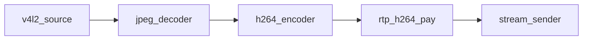
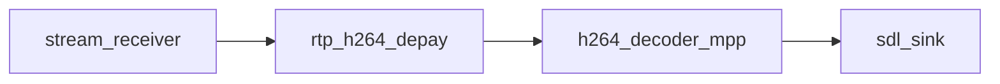

# Reference pipeline

Pad notation: `node.pad` — `A -> B.0` means A’s output links to B’s input pad 0.

## Rover (transmit)

| Link | Kind |
|------|------|
| … → `stream_sender.0` | `SOCK` (RTP datagrams) |

Reverse-path RX/gap metrics are not on the media graph. Bench apps poll
`stream_receiver`, push counters to `stream_sender::set_receiver_counters()`, and read
`peer_*` via `stream_sender::query()`; encoder rate is set via
`configure("cbr")` or the channel UDP console (`set_encode_cbr`).

Factory names: `v4l2_source`, `jpeg_decoder_multicore`, `h264_encoder_cedar`,
`rtp_h264_pay`, `stream_sender`.

## Ground station (receive)

| Link | Kind |
|------|------|
| `stream_receiver.0` → `rtp_h264_depay` | `SOCK` |
| decoder → `sdl_sink` | `FRAME` / NV12 |

Factory names: `stream_receiver`, `rtp_h264_depay`, `h264_decoder_mpp`, `sdl_sink`
(`display`), `sdl_kmsdrm_sink` (SDL `kmsdrm` on DRM/KMS). Build with
`-DENABLE_SDL_SINK=ON` (requires SDL2).

## Legacy aliases

`stream_sink` / `stream_source` factory names map to `stream_sender` /
`stream_receiver`.
