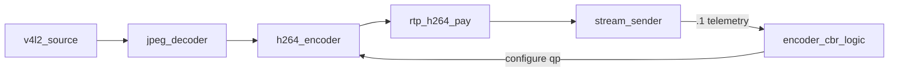
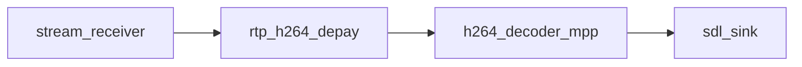

# Reference pipeline

Pad notation: `node.pad` — `A -> B.0` means A’s output links to B’s input pad 0.

## Rover (transmit)

| Link | Kind |
|------|------|
| … → `stream_sender.0` | `SOCK` (RTP datagrams) |
| `stream_sender.1` → `encoder_cbr_logic` | `stream_telemetry` (not `data_packet`) |

`stream_sender` implements `component_stream_telemetry` on pad 1. The core polls
`telemetry_snapshot()` and calls `encoder_cbr_logic::apply()`.

Factory names: `v4l2_source`, `jpeg_decoder_multicore`, `h264_encoder_cedar`,
`rtp_h264_pay`, `stream_sender`.

## Ground station (receive)

| Link | Kind |
|------|------|
| `stream_receiver.0` → `rtp_h264_depay` | `SOCK` |
| decoder → `sdl_sink` | `FRAME` / NV12 |

Factory names: `stream_receiver`, `rtp_h264_depay`, `h264_decoder_mpp`, `sdl_sink`
(`display`), `sdl_dmks_sink` (`dmks`, SDL `kmsdrm` on DRM/KMS). Build with
`-DENABLE_SDL_SINK=ON` (requires SDL2).

## Legacy aliases

`stream_sink` / `stream_source` factory names map to `stream_sender` /
`stream_receiver`.
