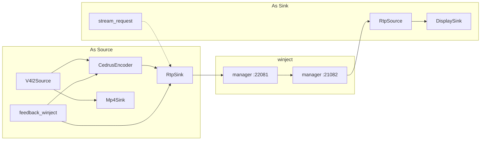

# Use case

VStreamer is a framework ([vstreamer.md](vstreamer.md)). The same core
runs on either end of an RTP path: **as source** it captures and injects;
**as sink** it receives and presents. Plugins change; the console and
`stream_request` deadman stay the same.



## As Source

The rover host (Orange Pi PC / H3) is the origin of video. This is the
extracted `~/rover/camera` graph.

| Class | Role |
|-------|------|
| `V4l2Source` | UVC MJPEG `/dev/video0`, 1280×720@30 |
| `NoiseSource` | 416×240 snow if capture is down; retry device ~1 Hz |
| `JpegDecoderMulticore` | JPEG → packed NV12 |
| `CedrusEncoder` | NV12 → H.264 (`qp` 36, `gop` 30) |
| `RtpSink` | RTP/H264 to `winject-manager` `:22081` (bus `c3`) |
| `Mp4Sink` | optional MJPEG→MP4 (`output`) |
| `feedback_winject` | local `gci` TX-queue → `configure` / `set_enabled` |

Talks to manager RTP bind `:22081` and camera console `:22092`. Does
**not** talk to the drive ESP32 or drive console `:22090`.

```
V4L2 UVC (MJPEG mmap)
        │
        ├─► MJPEG→MP4 recorder
        │
        ▼
  JPEG decode → packed NV12
        │
        ▼
  Cedar h264_cedrus
        │
        ▼
  RTP/H264 UDP   (off until stream_request; then paced by feedback)
```

Boot: RTP socket may be open, **send is off**. Capture, Cedar, and record
keep running. The GS must issue `stream_request` and renew it;
timeout 0 = no deadline. Feedback never enables RTP without that request.

If `/dev/video0` is missing or `select`/`DQBUF` returns `ENODEV` / `EIO` /
`ENXIO` / `EBADF`, the source switches to noise so the air path stays
alive, then retries the configured device.

**Config (rover)**

| Key | Default |
|-----|---------|
| `device` | `/dev/video0` |
| `format` | `mjpeg` |
| `stream` | `127.0.0.1:22081` |
| `size` | `1280x720` |
| `fps` | `30` |
| `qp` | `36` |
| `gop` | `30` |
| `mtu` | `1400` |

Need `stream` and/or `output`. Width ×32 (Cedar).

**Air ports**

| | Rover | GS |
|--|-------|-----|
| Camera RTP | manager bind `:22081` (TX bus `c3`) | connect `:21082` |
| Camera console | manager bind `:22092` (buses `92`/`93`) | bind `:21092` |

Manager camera upstream: FEC `k=10 n=12`, `scheduler_budget` 4096. Host
payload after the 2-byte air seq is at most 1474 bytes. Console does not
ride WireGuard.

## As Sink

The ground station (Orange Pi 5 today) is the destination of video. GS
currently runs GStreamer `udpsrc ! rtph264depay ! avdec_h264 !
autovideosink` on `:21082`. That receive graph becomes a VStreamer
instance with the opposite plugins.

| Class | Role |
|-------|------|
| `RtpSource` | bind/connect RTP/H264 from manager `:21082` (RX bus `c3`) |
| `H264Decoder` | H.264 → NV12 (software / SoC; not Cedar on the GS) |
| `DisplaySink` | local preview |
| `Mp4Sink` | optional record of MJPEG; H.264 file record is a later sink |
| `feedback_none` | encode pacing lives on the rover; this side does not drive Cedar |

This instance **issues** `stream_request` on the camera console
(`nc -u 127.0.0.1 21092` today). That is the operator deadman for the
source’s RTP sink. Preview without `stream_request` stays black because the rover
does not send.

Late join: rover `RtpSink` prepends cached SPS/PPS before slices.

Do not put encode-side `feedback_winject` on the GS. GS radio `gci`
`flow` is the **GS TX** queue (drive, WG, console), not the rover camera
TX ring. RX `rssi`/`snr`/`fec_lost` on the GS may later be forwarded to
the rover as extra feedback; they are not a local QP loop.

**Bench loopback**

One host can run both graphs (RTP send to `127.0.0.1`, RTP receive on
another port, no radio). Source still requires `stream_request` unless feedback is
`none` and the RTP sink is forced on for the test.
