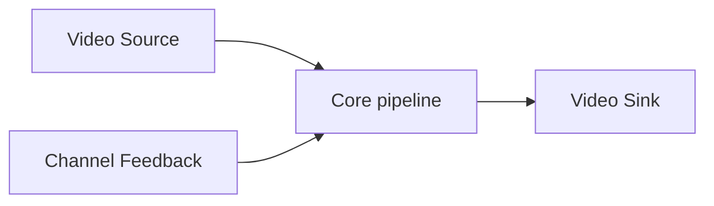

# VStreamer

VStreamer is a **framework** for building RTP video paths with channel
feedback for flow control. Applications compose **video sources**, **video
sinks**, optional **codecs**, and a **feedback** plugin. The framework does
not assume a camera, a radio, or a display — those are plugins.

The first plugins and the first application come from `~/rover/camera`
(UVC → Cedar → RTP). Rover keeps systemd, winject-manager binds, and
vehicle wiring. This repo owns the pipeline core and the plugin contracts.



A process is one graph: one source, zero or more sinks, one encoder slot,
one feedback plugin. Change the plugins and the same core is a rover
camera **or** a ground-station viewer. Deployments: [usecase.md](usecase.md).

| Core owns | Plugins own |
|-----------|-------------|
| Job/result queues, thread pins, lock order | Capture, file, RTP in/out, display |
| Console dispatch onto `configure` / `query` | Key semantics for that class |
| `stream_request` gate (operator deadman) | Radio CI, QP/GOP policy |
| Config `key = value` load | Device paths, destinations, codec opts |

Capture/decode/encode keep running when RTP is gated off. A record sink
attached **before** encode is independent of the RTP gate.

## Core

The core never opens V4L2, Cedar, or a UDP destination by itself. It:

1. Pulls timestamped `frame_s`s from `source::fetch`.
2. Optionally transcodes (`Decoder` then `Encoder`).
3. Writes each frame to every `Sink` whose `input_kind()` matches.
4. Applies feedback to encoder keys and to `Sink::set_enabled`.
5. Exposes a UDP console that maps verbs onto `configure` / `query`.

Thread layout is host-specific. On the H3, CPU0 is reserved for
`winject-manager`; fetch and one decode worker share CPU1, the second
decode worker CPU2, encode CPU3.

Queue depth 32. Width for Cedar plugins must be a multiple of 32.

## Plugins

Each plugin is an **interface class**. Shared `frame_s` / `media_kind_e`
live in core ([frame.hpp](../src/core/frame.hpp)).

| Interface | Doc | Data path |
|-----------|-----|-----------|
| `source` | [component-source.md](component-source.md) | `fetch` → owned `frame_s` |
| `sink` | [component-sink.md](component-sink.md) | `write(const frame_s&)` |
| `encoder` | [component-encoder.md](component-encoder.md) | NV12 → H.264 via `EmitFn` |
| `decoder` | [component-decoder.md](component-decoder.md) | MJPEG or H.264 → NV12 via `EmitFn` |

Core routes by `frame_s::kind`: MJPEG to pre-encode sinks + decoder, NV12
to encoder or display, H.264 to RTP (source graph) or decoder (sink
graph). Encoded output is still a `frame_s` with `kind = H264` (an access
unit).

**First implementations**

| Class | Kind | Notes |
|-------|------|-------|
| `V4l2Source` | MJPEG out | UVC mmap, 8 buffers |
| `NoiseSource` | MJPEG out | 416×240 snow if capture is down |
| `RtpSource` | H.264 out | receive; [usecase.md](usecase.md) *As Sink* |
| `RtpSink` | H.264 in | PT 96, FU-A; send off until `stream_request` |
| `Mp4Sink` | MJPEG in | record; independent of RTP gate |
| `DisplaySink` | NV12 in | GS preview |
| `CedrusEncoder` | NV12 → H.264 | reopen on qp/gop; `ENCODER=poc\|stock` |
| `JpegDecoderMulticore` | MJPEG → NV12 | rover CPU decode workers |
| `H264Decoder` | H.264 → NV12 | GS receive; not Cedar |

### Channel Feedback

Maps radio/operator signals onto encoder knobs and the RTP send gate.
`winject-manager` already receives radio channel-info UDP
(`set_upstream_ci`) and prints it on `gci`; it does **not** apply
backpressure. A feedback plugin is what actually slows encode.

| Call | Role |
|------|------|
| `open` / `close` | subscribe / poll |
| `sample` | latest flow / RSSI / SNR / loss |
| `apply` | QP, GOP, skip, fps, RTP enable |

**Inputs** (winject `gci` / CI datagrams)

| Field | Meaning |
|-------|---------|
| `flow` `size/cap` | radio TX queue depth / capacity |
| `rssi` / `snr` | last RX air sample on this radio |
| `rx_pkt_loss` | air seq gaps |
| `fec_rec` / `fec_lost` | recovered vs unrecoverable blocks |
| `stream_request` | operator gate; still required to send |

Radio CI wire: type 1 = `{tx_queue_size, tx_queue_capacity}`; type 2 =
`{rssi, snr}`. Poll manager UDP `gci`, or subscribe to a CI copy. Do not
talk to WT32 TCP `:2323`.

**Policy (source-side encode)**

| Condition | Action |
|-----------|--------|
| no live `stream_request` | RTP sink off; source+encode+record continue |
| `flow` filling | raise QP, skip non-ref frames, and/or drop fps |
| `flow` empty and SNR healthy | lower QP toward the configured floor |
| CI stale / manager down | treat as full queue; stop RTP send |
| `fec_lost` rising | raise QP / shrink GOP toward 1 |

Rate-limit encoder/capture reopens. Feedback **never** enables RTP when
the operator has not requested the stream. It writes encoder keys through
`Encoder::configure` and the RTP gate through `Sink::set_enabled`.

`feedback_none` is valid (bench, file record). `feedback_winject` is the
rover plugin.

## Console

Optional UDP, newline-terminated. Replies `ok` / `err <reason>` / `pong`.
The core parses the verb and calls `configure` / `query` on the owning
instance. Keys are the interface; each plugin owns its key semantics.

On a winject host the process is a **connected UDP client** to the
manager bind. Split `--console_in` / `--console_out` is local bench only.
Client `ping` → `pong`. One `ok\n` at open seeds last-sender; no
unsolicited keepalive.

## Config

One `key = value` per line (`#` comments). Core keys select plugins and
graph edges; remaining keys are passed to the matching instance.

| Core key | Role |
|----------|------|
| `source` | plugin name (`v4l2`, `rtp`, `noise`) |
| `sink` | one or more (`rtp`, `mp4`, `display`) |
| `encoder` | `cedrus` / `none` |
| `decoder` | `mjpeg` / `h264` / `none` |
| `feedback` | `winject` / `none` |
| `stream` | RTP send `host:port` |
| `listen` | RTP receive `host:port` |
| `output` | record path |
| `size` `fps` `qp` `gop` `mtu` `frames` | codec / RTP |

Need at least one sink (or `output`). CLI: `--config <cfg>` plus optional
`--console_in` / `--console_out`.

Rover camera defaults and ports: [usecase.md](usecase.md).

## Build

Components are selected at configure time (`cmake -DENABLE_<COMPONENT>=ON|OFF`).
Generated `components/components_config.hpp` defines the same macros for `#ifdef`
in application code. Include [`components.hpp`](../src/components/components.hpp)
to pull in enabled headers only.

| CMake option | Component |
|--------------|-----------|
| `ENABLE_NOISE_SOURCE` | `noise_source` (default ON) |
| `ENABLE_V4L2_SOURCE` | `v4l2_source` (default ON; requires `ENABLE_NOISE_SOURCE`) |
| `ENABLE_JPEG_DECODER_MULTICORE` | `jpeg_decoder_multicore` (default ON) |
| `ENABLE_H264_DECODER_MPP` | `h264_decoder_mpp` (default ON; links `rockchip_mpp`) |
| `ENABLE_H264_ENCODER_CEDAR` | `h264_encoder_cedar` (default OFF; links libav) |
| `ENABLE_H264_ENCODER_INTEL` | `h264_encoder_intel` (default OFF; libav `h264_vaapi`) |

Example rover (no GS MPP decode):

```bash
cmake -B build -DENABLE_H264_DECODER_MPP=OFF -DENABLE_H264_ENCODER_CEDAR=ON
cmake --build build
```

Example ground station (no rover JPEG path):

```bash
cmake -B build -DENABLE_NOISE_SOURCE=OFF -DENABLE_V4L2_SOURCE=OFF \
  -DENABLE_JPEG_DECODER_MULTICORE=OFF -DENABLE_H264_ENCODER_CEDAR=OFF
cmake --build build
```

## Extraction map

| rover/camera | framework |
|--------------|-----------|
| `camera.c` V4L2 + noise | `V4l2Source` / `NoiseSource` |
| `camera.c` `rtp_sink` + Annex-B / FU-A | `RtpSink` |
| `camera.c` `recorder` | `Mp4Sink` |
| `encoder.h` + `encoder_cedrus.c` | `CedrusEncoder` |
| JPEG workers in `camera.c` | `JpegDecoderMulticore` |
| `camera.c` `stream_request` timeout | core → `Sink::set_enabled` |
| *(new)* manager `gci` / CI | `feedback_winject` |
| *(new)* RTP depay + display | `RtpSource` + `H264Decoder` + `DisplaySink` |
| `camera.cfg` / `start.sh` / Makefile | apps on this tree |

Glue that stays in core: queues, pins, lock order (`cfg` before encoder),
`EmitFn` into sinks.

Out of scope: drive ESP32, drive console `:22090`, winject TCP `:2323`,
radio firmware.
